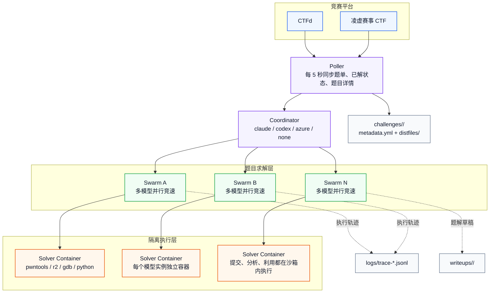

# Hunting Blade

Hunting Blade 是基于 `ctf-agent` 的二开版本。在同一道题交给多个大模型并行求解的基础理念上进一步工程化：支持整场轮询、国内竞赛平台接入、手动导入题目题、自动收尾与监听新题目下发、凌虚竞赛平台环境自动释放，以及赛后 writeup 的自动撰写。下面是几个值得注意的点：

1. `ctf-solve` 不传 `--challenge` 时是整场模式；传了 `--challenge` 时是单题模式。
2. 如果你本机没有可用的 `codex` 或 Claude SDK，不要直接使用默认模型列表；请显式传 `--models`，并优先选择 `--coordinator azure` 或 `--coordinator none`。
3. `--all-solved-policy` 默认值是 `wait`，所以全题解完后会继续等待新题，不会自动退出。

## 主要命令

| 命令 | 用途 |
|------|------|
| `ctf-solve` | 整场比赛求解，或对单题目录进行本地调试 |
| `ctf-msg` | 给正在运行的协调器发送操作员消息 |
| `ctf-import` | 把人工整理的题面、附件、连接信息导入为标准本地题目目录 |

## 增强改进

| 能力 | 当前状态 | 说明 |
|------|----------|------|
| 中文化说明 | 已完成 | README、CLI 帮助文案、使用示例均以中文为主 |
| 平台接入 | 已支持 | 当前支持 `ctfd` 和 `lingxu-event-ctf` |
| API 总控整场模式 | 已支持 | `--coordinator azure`，solver 与总控都只走 `.env` 里的 Azure 通道 |
| 无总控整场模式 | 已支持 | `--coordinator none`，适合并发紧张或不需要顶层策略的场景 |
| 手动导题 | 已支持 | `ctf-import` 可写入 `metadata.yml` 和 `distfiles/` |
| 自动收尾 | 已支持 | `wait` / `exit` / `idle` 三种整场结束策略 |
| 环境释放 | 已支持 | 平台确认提交成功后，自动释放需要环境的题目 |
| Writeup 输出 | 已支持 | `off` / `confirmed` / `solved` 三种策略 |

## 上游关系

本仓库 fork 自 `ctf-agent`。上游项目由 Veria Labs 构建，曾在 BSidesSF 2026 CTF 中拿到 52/52 全解和第 1 名。这个 README 主要描述的是当前这个 fork 的功能和用法，而不是重复上游战绩。

## 支持范围

| 项目 | 状态 | 说明 |
|------|------|------|
| 平台 `ctfd` | 已支持 | 推荐使用 `--ctfd-url` + `--ctfd-token` |
| 平台 `lingxu-event-ctf` | 已支持 | 当前面向“赛事 CTF”；`check` 模式会跳过，不启动 swarm |
| 题型 | 已覆盖主要类型 | `pwn`、`rev`、`crypto`、`forensics`、`web`、`misc` |
| 运行方式 | 已支持 | 整场模式、单题模式、手动导题 |
| 协调模式 | 已支持 | `claude`、`codex`、`azure`、`none` |

## 架构设计



整体流程很简单：

1. `Poller` 每 5 秒从平台同步题单和已解状态。
2. `Coordinator` 根据当前模式决定是否启用顶层总控大模型。
3. 每道未解题会启动一个 `Swarm`，每个 `Swarm` 内再并行运行多个 solver 容器。
4. 平台确认提交正确后，系统会自动停掉对应 swarm，并按配置决定是否释放环境、生成 wp、退出整场。

## 快速安装

### 环境要求

- Python `3.14+`
- `uv`
- Docker
- 至少一种平台凭据：CTFd 的 URL 与 Token或凌虚赛事 CTF 的平台根地址、赛事 ID、有效 Cookie
- 至少一种可用的模型接入方式：本机 `codex`、本机 Claude SDK、或 API 型模型，例如 `azure/...`、`google/...`、`bedrock/...`、`zen/...`

### 安装依赖

```bash
uv sync
docker build -f sandbox/Dockerfile.sandbox -t ctf-sandbox .
```

### `.env` 示例

先复制模板：

```bash
cp .env.example .env
```

下面是一份实用的 `.env` 参考。你不需要全部填写，只要填你实际要用的那部分。

```env
# CTFd
CTFD_URL=https://ctf.example.com
CTFD_TOKEN=ctfd_your_api_token_here

# OpenAI-compatible gateway
OPENAI_API_KEY=sk-...
OPENAI_BASE_URL=https://api.masterjie.eu.cc/v1
AZURE_OPENAI_ENDPOINT=https://api.masterjie.eu.cc/v1
AZURE_OPENAI_API_KEY=sk-...

# Claude / Gemini / 其他 provider 按需填写
ANTHROPIC_API_KEY=
GEMINI_API_KEY=
AWS_REGION=us-east-1
AWS_BEARER_TOKEN=
OPENCODE_ZEN_API_KEY=

# Lingxu Event CTF
PLATFORM=lingxu-event-ctf
PLATFORM_URL=https://ctf.yunyansec.com
LINGXU_EVENT_ID=198
LINGXU_COOKIE=sessionid=your_session_cookie
```

说明：

- `.env` 会自动读取，CLI 参数优先级高于 `.env`。
- 对 CTFd，优先使用 `CTFD_TOKEN`；账号密码方式只适合你自己额外扩展，不是当前 CLI 主路径。
- 凌虚竞赛平台，Cookie 里只要 `sessionid` 可用通常就够了；浏览器里没有 `csrftoken` 也属于正常情况。
- `--coordinator azure` 和 `--models azure/...` 一样，都只读取 `.env` 中的 `AZURE_OPENAI_ENDPOINT` / `AZURE_OPENAI_API_KEY`，不依赖本机 Codex 配置文件。

### 注意事项

如果你直接运行：

```bash
uv run ctf-solve ...
```

而且没有传 `--models`，程序会使用默认模型列表：

- `claude-sdk/claude-opus-4-6/medium`
- `claude-sdk/claude-opus-4-6/max`
- `codex/gpt-5.4`
- `codex/gpt-5.4-mini`
- `codex/gpt-5.3-codex`

这意味着：你需要本机具备对应的 `codex` / Claude SDK 运行能力。如果你没有这些本地能力，请显式传 API 型模型，例如 `azure/gpt-5.4`、`azure/gpt-5.4-mini`。如果你想让 solver 和总控都只走 `.env`，优先用 `--coordinator azure`；如果你只想保留最小编排闭环，优先用 `--coordinator none`。

## 运行方式

| 目标 | 推荐组合 | 原因 |
|------|----------|------|
| 先跑起来 | `--coordinator azure` + 2 到 3 个 `azure/...` | solver 和总控都只走 `.env`，不依赖本地 Codex/Claude |
| 最小闭环 | `--coordinator none` + 2 到 3 个 API 型 `--models` | 完全不要顶层模型总控，失败面最小 |
| 要顶层策略调度 | `--coordinator azure`、`--coordinator codex` 或 `--coordinator claude` | 总控会读取 solver trace 并广播提示 |
| 只做流程回归，不真提交 | `--no-submit` + `--writeup-mode solved` | 能保留大部分真实流程，又不会真正交 flag |
| 解完就退出 | `--all-solved-policy exit` | 没有未解题且没有活动 swarm 时直接结束 |
| 解完后再等一会儿 | `--all-solved-policy idle --all-solved-idle-seconds 600` | 适合比赛末尾等加题或等平台刷新 |

## 并发估算

整场模式下，实际 solver 容器并发大致等于：

```text
模型数量 × max_challenges
```

再加上：如果 `--coordinator` 是 `codex`、`claude` 或 `azure`，还会额外多一个总控并发。

- 2 个模型，`--max-challenges 3`，大约是 6 个 solver 并发。
- 3 个模型，`--max-challenges 3`，大约是 9 个 solver 并发。
- 如果此时还开了 `--coordinator codex`、`--coordinator claude` 或 `--coordinator azure`，再预留 1 个总控并发更稳妥。

  如果你的模型网关最高并发只有 10，建议从下面两组起步：

- 2 个模型 + `--max-challenges 3`
- 3 个模型 + `--max-challenges 2`

## 快速开始

### 1. 凌虚赛事 CTF 整场-API 模型-`.env only` Azure 总控

这是“solver + 总控都不依赖本机 Codex/Claude”的推荐组合：

```bash
uv run ctf-solve \
  --platform lingxu-event-ctf \
  --platform-url https://ctf.yunyansec.com \
  --lingxu-event-id 198 \
  --coordinator azure \
  --models azure/gpt-5.4 \
  --models azure/gpt-5.4-mini \
  --max-challenges 3 \
  --all-solved-policy exit \
  --writeup-mode confirmed \
  --writeup-dir writeups \
  --msg-port 9400 \
  -v
```

这条命令适合：

- 你不想依赖本机 `codex` 或 Claude SDK
- 你希望 solver 和总控都只走 `.env` 里的 Azure 通道
- 你需要顶层调度，但不想再绑死在本机配置文件上

### 2. CTFd 整场-API 模型-无总控

这是最适合第一次跑通流程的起手式：

```bash
uv run ctf-solve \
  --ctfd-url https://ctf.example.com \
  --ctfd-token ctfd_your_token \
  --coordinator none \
  --models azure/gpt-5.4 \
  --models azure/gpt-5.4-mini \
  --challenges-dir challenges \
  --max-challenges 3 \
  --msg-port 9400 \
  -v
```

这条命令适合：

- 你本机没有 `codex` 或 Claude SDK
- 你想优先验证整场轮询、拉题、起 swarm、自动收尾是否正常
- 你不想额外消耗一个总控并发

### 3. 凌虚赛事 CTF 整场-API 模型-无总控

```bash
uv run ctf-solve \
  --platform lingxu-event-ctf \
  --platform-url https://ctf.yunyansec.com \
  --lingxu-event-id 198 \
  --lingxu-cookie-file .secrets/lingxu.cookie \
  --coordinator none \
  --models azure/gpt-5.4 \
  --models azure/gpt-5.4-mini \
  --challenges-dir challenges \
  --max-challenges 3 \
  --msg-port 9400 \
  -v
```

这条命令适合：

- 你在打凌虚“赛事 CTF”
- 你只想先让整场调度稳定跑起来
- 你不需要顶层总控大脑

### 4. 启用 Codex 总控

如果你本机已经配置好了 `codex`，想让顶层协调器也参与调度，可以这样跑：

```bash
uv run ctf-solve \
  --ctfd-url https://ctf.example.com \
  --ctfd-token ctfd_your_token \
  --coordinator codex \
  --coordinator-model gpt-5.4 \
  --models codex/gpt-5.4 \
  --models codex/gpt-5.4-mini \
  --max-challenges 3 \
  --msg-port 9400 \
  -v
```

要点：

- `--coordinator codex` 只影响“顶层协调器”。
- 每道题 swarm 内跑什么模型，仍由 `--models` 决定。
- 总控会读取 solver trace，在卡住时广播更具体的策略提示。

### 4. 单题本地调试

```bash
uv run ctf-solve \
  --challenge challenges/example-challenge \
  --ctfd-url https://ctf.example.com \
  --ctfd-token ctfd_your_token \
  --no-submit \
  -v
```

单题模式的前提：

- `--challenge` 传的是本地目录，不是题目名。
- 目录下至少要有 `metadata.yml`。
- 附件应放在 `distfiles/`。

示例目录：

```text
challenges/example-challenge/
├── metadata.yml
└── distfiles/
    ├── chall
    └── note.txt
```

## 场景使用

### 场景 1：CTFd 整场自动求解

```bash
uv run ctf-solve \
  --ctfd-url https://ctf.example.com \
  --ctfd-token ctfd_your_token \
  --coordinator none \
  --models azure/gpt-5.4 \
  --models azure/gpt-5.4-mini \
  --max-challenges 3 \
  --msg-port 9400 \
  -v
```

运行后会发生的事：

1. 校验平台配置并初始化轮询器。
2. 每 5 秒检查一次题单和已解状态。
3. 自动把新题写入 `challenges/<slug>/metadata.yml` 与 `distfiles/`。
4. 为每道未解题启动一个 swarm。
5. 某道题被确认解出后，自动结束对应 swarm。

### 场景 2：凌虚赛事 CTF 整场自动求解

```bash
uv run ctf-solve \
  --platform lingxu-event-ctf \
  --platform-url https://ctf.yunyansec.com \
  --lingxu-event-id 198 \
  --lingxu-cookie-file .secrets/lingxu.cookie \
  --coordinator none \
  --models azure/gpt-5.4 \
  --models azure/gpt-5.4-mini \
  --max-challenges 3 \
  --msg-port 9400 \
  -v
```

凌虚平台这几个点很关键：

- `--platform-url` 要填平台根地址，例如 `https://ctf.yunyansec.com`，不要填前端 hash 页面。
- Cookie 推荐放文件里，用 `--lingxu-cookie-file` 传入，避免命令历史泄露。
- 一般不需要你先手动逐题点“开启环境”；适配器会自动做 `begin`、`run`、`addr` 这几个步骤。
- 如果平台同时返回公网地址和内网地址，适配器会优先使用公网 `domain_addr`。
- `check` 模式题会标记为不支持并跳过，不会卡死整场结束逻辑。

### 场景 3：想要顶层总控参与调度

你可以在 `claude`、`codex`、`azure`、`none` 四种模式里选一种：

| 取值 | 适合场景 | 要求 |
|------|----------|------|
| `claude` | 你希望 Claude 作为顶层调度脑 | 本机可用 Claude SDK |
| `codex` | 你希望 Codex 作为顶层调度脑 | 本机可用 `codex` |
| `azure` | 你希望顶层总控也走 `.env` API 通道 | `.env` 中可用 Azure/OpenAI-compatible gateway |
| `none` | 你不想占总控并发，只保留自动调度 | 不需要本地总控能力 |

如果你没有本地 `codex` 或 Claude SDK，但又想跑整场：

```bash
uv run ctf-solve \
  --ctfd-url https://ctf.example.com \
  --ctfd-token ctfd_your_token \
  --coordinator azure \
  --models azure/gpt-5.4 \
  --models azure/gpt-5.4-mini
```

### 场景 4：Dry-run，不真的提交 flag

```bash
uv run ctf-solve \
  --platform lingxu-event-ctf \
  --platform-url https://ctf.yunyansec.com \
  --lingxu-event-id 198 \
  --lingxu-cookie-file .secrets/lingxu.cookie \
  --coordinator none \
  --models azure/gpt-5.4-mini \
  --no-submit \
  --writeup-mode solved \
  --writeup-dir tmp-writeups \
  -v
```

这个组合的效果：

- 不真的向平台提交 flag。
- 仍然会执行大部分真实求解流程。
- 不会触发“平台确认成功后的自动释放环境”。
- 由于 `--writeup-mode solved`，只要本地 solver 成功，就仍会生成 writeup。

### 场景 5：给协调器发人工提示

先启动整场：

```bash
uv run ctf-solve \
  --ctfd-url https://ctf.example.com \
  --ctfd-token ctfd_your_token \
  --coordinator codex \
  --msg-port 9400 \
  -v
```

再从另一个终端发送消息：

```bash
uv run ctf-msg --port 9400 "优先检查所有 web 题是否共用一套登录逻辑。"
```

注意：

- `ctf-msg` 默认端口是 `9400`。
- `--msg-port 0` 表示启动时自动找空闲端口，这时你需要从日志里看实际端口。
- 如果当前是 `--coordinator none`，消息仍会被接收和记录，但不会再经过顶层大模型做二次调度。

### 场景 6：手动导题到本地

最小示例：

```bash
uv run ctf-import \
  --name "签到题" \
  --category misc \
  --description "阅读附件并找出 flag。" \
  --attachment ./downloads/task.zip \
  --output-dir ./challenges
```

带连接信息、目录附件、标签和提示的示例：

```bash
uv run ctf-import \
  --name "Web1" \
  --category web \
  --description "分析登录流程并获取管理员权限。" \
  --connection-info "http://target.example.com" \
  --attachment ./downloads/web1.tar.gz \
  --attachment-dir ./downloads/web1-assets \
  --tag login \
  --tag jwt \
  --hint "先看前端接口调用关系" \
  --output-dir ./challenges \
  --value 200
```

导入后会生成：

```text
challenges/web1/
├── metadata.yml
└── distfiles/
    ├── web1.tar.gz
    └── ...
```

`ctf-import` 当前行为：

- 自动生成标准 `metadata.yml`
- 自动复制单文件附件
- 递归复制 `--attachment-dir` 中的所有文件
- 检测附件重名冲突
- 如果目标目录已存在，会安全替换并带回滚保护
- 至少要求“连接信息、附件文件、附件目录”三者之一不为空

### 场景 7：先把 CTFd 题目批量拉到本地再调试

```bash
uv run python pull_challenges.py \
  --url https://ctf.example.com \
  --token ctfd_your_token \
  --output ./challenges
```

拉完以后，你就可以对任意单题目录使用：

```bash
uv run ctf-solve --challenge challenges/example-challenge --no-submit -v
```

## 自动收尾、环境释放、writeup

### `--all-solved-policy`

| 取值 | 行为 | 适合场景 |
|------|------|----------|
| `wait` | 全部题目解完后继续轮询，等新题或人工停止 | 直播比赛、平台可能继续上新题 |
| `exit` | 没有未解题且没有活动 swarm 时立即退出 | 比赛结束后做收尾，或批处理跑一遍就结束 |
| `idle` | 进入空闲观察期，持续空闲达到阈值后退出 | 想再等等新题，但不想无限挂着 |

`idle` 模式必须配合：

```bash
--all-solved-policy idle --all-solved-idle-seconds 600
```

### `--writeup-mode`

| 取值 | 何时生成 | 适合场景 |
|------|----------|----------|
| `off` | 不生成 | 只关心比赛过程 |
| `confirmed` | 平台确认提交成功后生成 | 正式赛后归档 |
| `solved` | 本地 solver 成功时就生成 | Dry-run、回归测试、先沉淀题解草稿 |

`--writeup-dir` 是根目录，不是最终目录。实际路径会自动加一层平台和赛事，例如：

```text
writeups/lingxu-event-ctf-198/echo.md
```

### 环境释放什么时候发生

自动释放环境的触发条件只有这一套：

1. 题目元信息里 `requires_env_start: true`
2. 平台确认 flag 提交正确
3. 当前不是 `--no-submit`

反过来说：

- 只是在本地看起来“像是解出来了”，不会提前释放环境。
- `--no-submit` 不会自动释放环境。
- 非环境题即使提交成功，也不会调用释放逻辑。

### 实用组合

正式打凌虚赛事，确认提交成功后生成 writeup，且全题解出后立即退出：

```bash
uv run ctf-solve \
  --platform lingxu-event-ctf \
  --platform-url https://ctf.yunyansec.com \
  --lingxu-event-id 198 \
  --lingxu-cookie-file .secrets/lingxu.cookie \
  --coordinator none \
  --models azure/gpt-5.4 \
  --models azure/gpt-5.4-mini \
  --all-solved-policy exit \
  --writeup-mode confirmed \
  --writeup-dir writeups \
  --msg-port 9400 \
  -v
```

整场跑完后再空闲 10 分钟退出：

```bash
uv run ctf-solve \
  --ctfd-url https://ctf.example.com \
  --ctfd-token ctfd_your_token \
  --coordinator none \
  --models azure/gpt-5.4 \
  --models azure/gpt-5.4-mini \
  --all-solved-policy idle \
  --all-solved-idle-seconds 600 \
  --writeup-mode confirmed \
  --writeup-dir writeups/ctfd-main \
  --msg-port 9400 \
  -v
```

不提交 flag，但按本地成功结果生成 writeup：

```bash
uv run ctf-solve \
  --platform lingxu-event-ctf \
  --platform-url https://ctf.yunyansec.com \
  --lingxu-event-id 198 \
  --lingxu-cookie-file .secrets/lingxu.cookie \
  --coordinator none \
  --models azure/gpt-5.4-mini \
  --no-submit \
  --all-solved-policy idle \
  --all-solved-idle-seconds 300 \
  --writeup-mode solved \
  --writeup-dir tmp-writeups \
  -v
```

## 参数详解

### `ctf-solve` 参数

#### 平台与认证

| 参数 | 默认值 | 说明 | 什么时候需要 |
|------|--------|------|--------------|
| `--platform` | `ctfd` | 题目来源平台，支持 `ctfd` 和 `lingxu-event-ctf` | 要切换到凌虚时必传 |
| `--platform-url` | 空 | 平台根地址 | 凌虚赛事 CTF 必填 |
| `--lingxu-event-id` | 空 | 凌虚赛事 ID | 凌虚赛事 CTF 必填 |
| `--lingxu-cookie` | 空 | 直接传入 Cookie 原文 | 临时调试用 |
| `--lingxu-cookie-file` | 空 | 从文件读取 Cookie | 长期使用推荐 |
| `--ctfd-url` | `.env` 或 `http://localhost:8000` | CTFd 地址 | 使用 CTFd 时需要 |
| `--ctfd-token` | `.env` 或空 | CTFd API Token | 使用 CTFd 时推荐必传 |

#### 模型、调度与执行

| 参数 | 默认值 | 说明 | 什么时候需要 |
|------|--------|------|--------------|
| `--image` | `ctf-sandbox` | Docker 沙箱镜像名 | 你换了镜像名时 |
| `--models` | 默认模型列表 | 求解模型，可重复传入 | 想控制 solver 组合时；无本地 Codex/Claude 时建议显式传 |
| `--challenge` | 空 | 本地单题目录 | 只调试单题时 |
| `--challenges-dir` | `challenges` | 题目根目录 | 想改本地题目存放位置时 |
| `--no-submit` | `false` | 只求解，不提交 flag | 做 dry-run 或本地调试时 |
| `--coordinator` | `claude` | 顶层协调器后端：`claude`、`codex`、`azure`、`none` | 想切换总控模式时 |
| `--coordinator-model` | 后端默认值 | 覆盖顶层协调器模型 | 想手动指定总控模型时 |
| `--max-challenges` | `10` | 同时处理的题目上限 | 想控并发时 |

#### 收尾、输出与交互

| 参数 | 默认值 | 说明 | 什么时候需要 |
|------|--------|------|--------------|
| `--all-solved-policy` | `wait` | 全部题目处理完后的策略：`wait`、`exit`、`idle` | 想自动退出时 |
| `--all-solved-idle-seconds` | `300` | `idle` 模式的空闲超时秒数，必须大于 0 | 使用 `idle` 时 |
| `--writeup-mode` | `off` | writeup 模式：`off`、`confirmed`、`solved` | 想落盘题解时 |
| `--writeup-dir` | `writeups` | writeup 根目录 | 想单独存放输出时 |
| `--msg-port` | `0` | 操作员消息端口，`0` 表示自动选择空闲端口 | 想用 `ctf-msg` 时建议固定 |
| `-v`, `--verbose` | `false` | 输出详细日志 | 排查问题时建议打开 |

### `ctf-msg` 参数

| 参数 | 默认值 | 说明 |
|------|--------|------|
| `MESSAGE` | 无 | 发送给协调器的消息正文 |
| `--port` | `9400` | 协调器消息端口 |
| `--host` | `127.0.0.1` | 协调器主机地址 |

### `ctf-import` 参数

| 参数 | 默认值 | 说明 |
|------|--------|------|
| `--name` | 无 | 题目名称，必填 |
| `--category` | 无 | 题目类型，必填 |
| `--description` | 无 | 题目描述，必填 |
| `--connection-info` | 空 | 连接信息，例如 URL 或 `nc host port` |
| `--attachment` | 空 | 单个附件文件，可重复传入 |
| `--attachment-dir` | 空 | 附件目录，会递归复制其中所有文件 |
| `--output-dir` | `challenges` | 输出目录 |
| `--value` | `0` | 题目分值 |
| `--tag` | 空 | 标签，可重复传入 |
| `--hint` | 空 | 提示，可重复传入 |

`ctf-import` 的输入约束：

- `--name`、`--category`、`--description` 不能为空。
- `--connection-info`、`--attachment`、`--attachment-dir` 至少要提供一类。
- 同名附件会报冲突，不会静默覆盖。

## 目录输出

| 路径 | 作用 |
|------|------|
| `challenges/` | 拉下来的题目目录，或 `ctf-import` 生成的本地题目目录 |
| `logs/` | 每个 solver 的 JSONL trace |
| `writeups/` | 自动生成的 writeup 根目录 |

典型题目目录：

```text
challenges/example-challenge/
├── metadata.yml
└── distfiles/
```

自动 writeup 的典型路径：

```text
writeups/lingxu-event-ctf-198/echo.md
```

solver 容器中的关键挂载点：

- `/challenge/metadata.yml`：只读题目元信息
- `/challenge/distfiles/`：只读附件目录
- `/challenge/workspace/`：临时工作目录，可写

注意：

- `workspace` 是运行期目录，solver 结束后不会自动长期保留。
- `distfiles/` 是只读挂载，solver 产物应写到 `/challenge/workspace/`。

## 逻辑模式

整场模式下，大致顺序如下：

1. 读取 `.env` 和命令行参数，构造 `Settings`。
2. 按 `模型数量 × max_challenges` 计算容器并发上限。
3. 清理上次异常退出残留的孤儿容器。
4. 创建平台客户端并校验访问。
5. 启动轮询器，每 5 秒同步一次题单和已解状态。
6. 对每道未解题自动拉题、写入本地目录、准备环境、启动 swarm。
7. 某题解出后，记录结果并根据配置决定是否提交、释放环境、写 writeup。
8. 根据 `--all-solved-policy` 决定继续等待还是退出。

单题模式下，大致顺序如下：

1. 读取本地 `metadata.yml`
2. 启动对应题目的 `ChallengeSwarm`
3. 并发运行多个 solver
4. 某个 solver 成功后，取消其余 solver
5. 根据配置决定是否提交、写 writeup、释放环境

## 二开入口

| 路径 | 作用 |
|------|------|
| `backend/cli.py` | 三个 CLI 入口：`ctf-solve`、`ctf-msg`、`ctf-import` |
| `backend/config.py` | 运行时配置与 `.env` 读取 |
| `backend/models.py` | 默认模型列表和 provider 解析 |
| `backend/agents/` | 协调器、solver、swarm 的核心逻辑 |
| `backend/platforms/` | 平台抽象层，以及 CTFd / 凌虚适配器 |
| `backend/challenge_import.py` | 手动导题逻辑 |
| `backend/prompts.py` | prompt 组装与附件枚举 |
| `backend/solve_lifecycle.py` | 提交、收尾、writeup、环境释放闭环 |
| `backend/writeups.py` | writeup 生成逻辑 |
| `backend/sandbox.py` | Docker 容器创建、挂载、并发控制 |
| `pull_challenges.py` | 手动批量拉取 CTFd 题目 |

如果你要继续做平台接入、收尾策略、writeup 模板或 solver 工具扩展，通常先看这几个文件就够了。

## 常见问题

### 1. 为什么所有题都解完了，程序还不退出？

因为默认是：

```bash
--all-solved-policy wait
```

它的语义就是“继续等新题”。如果你想自动退出，用：

```bash
--all-solved-policy exit
```

或者：

```bash
--all-solved-policy idle --all-solved-idle-seconds 600
```

### 2. 不装本地 Codex 或 Claude，能不能直接用？

可以，前提是：

- 你的 solver 模型改成 API 型 `--models`
- 顶层协调器改成 `--coordinator azure` 或 `--coordinator none`

示例：

```bash
uv run ctf-solve \
  --ctfd-url https://ctf.example.com \
  --ctfd-token ctfd_your_token \
  --coordinator azure \
  --models azure/gpt-5.4 \
  --models azure/gpt-5.4-mini
```

如果你只是想保留最小闭环、不需要顶层策略调度，再把 `--coordinator azure` 换成 `--coordinator none` 即可。

### 3. 凌虚平台登录后没看到 `csrftoken`，正常吗？

正常。当前适配器只要求 Cookie 中有有效的 `sessionid`。如果浏览器里同时有 `csrftoken`，可以一起保留；没有也不影响当前接入。

### 4. 凌虚环境题需要我手动点击“开启环境”吗？

通常不需要。当前适配器会在需要环境的题目上自动调用平台的 `begin`、`run`、`addr` 流程，并把最终连接信息写回 `metadata.yml`。

例外情况：

- 平台权限过期
- 平台接口本身异常
- 目标赛事页面无法正常返回环境地址

这时才需要你人工介入。

### 5. 为什么有时会看到 `192.168.x.x` 这种地址？

那通常是平台接口返回的内网地址。当前凌虚适配器会优先使用公网 `domain_addr`；如果平台只返回了内网 `ext_id`，那说明问题在平台返回值本身，不是 README 写错了。

### 6. 为什么提示 `address already in use`？

如果你看到类似：

```text
Could not start operator message endpoint: ... address already in use
```

说明 `--msg-port` 绑定的端口已被占用。常见原因：

- 之前的 `ctf-solve` 还在运行
- 另一个进程已经占用了同样的端口

处理方式：

- 结束旧进程
- 或换一个端口，例如 `--msg-port 9301`

### 7. 为什么 `ctf-msg` 发送后看起来没反应？

如果当前是 `--coordinator none`，消息会被接收和记录，但没有顶层大模型去阅读和重新调度。这不是 bug，而是 `none` 模式的定义。

如果当前是 `--coordinator azure`、`--coordinator codex` 或 `--coordinator claude`，这些消息会进入顶层协调器，用于二次调度和定向 bump。

### 8. 为什么没生成 writeup？

常见原因只有这几类：

- 你没有开启 `--writeup-mode`
- 你用了 `--writeup-mode confirmed`，但当前是 `--no-submit`
- solver 并没有真正产出成功结果

如果你只是想在 dry-run 阶段沉淀题解草稿，用：

```bash
--writeup-mode solved
```

## 致谢

- 上游项目 `ctf-agent`
- [Veria Labs](https://verialabs.com)
- https://ctftime.org/team/222911
- [es3n1n/Eruditus](https://github.com/es3n1n/Eruditus)，`pull_challenges.py` 中的部分 CTFd 交互思路参考了该项目
